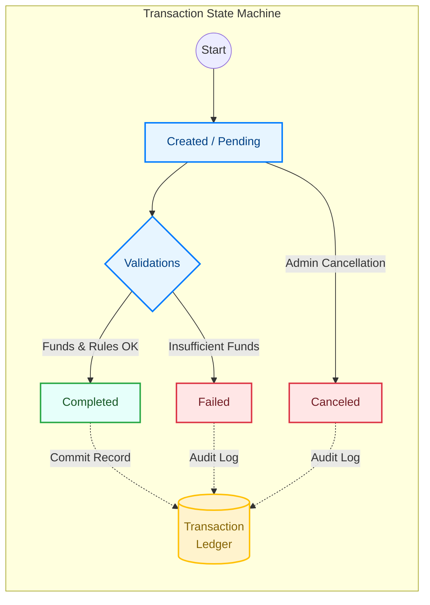

# 💳 SmartWallet - Digital Banking Ecosystem


**SmartWallet** is a high-performance digital wallet management platform designed with **Clean Architecture** and **SOLID** principles. It features a robust financial auditing system (Ledger), bank-grade security protocols, and a containerized deployment strategy for Azure.

> **Key Differentiator:** Unlike standard wallet apps, SmartWallet implements a double-entry **Transaction Ledger** to ensure 100% traceability and auditability of financial movements.

---

## 🏗️ System Architecture

The solution implements a **Clean Architecture** pattern to decouple business rules from infrastructure and UI, ensuring maintainability and testability.

### Layered Structure
* **`SmartWallet.Domain`**: The core. Contains Entities (`User`, `Wallet`, `Transaction`, `Ledger`), business rules, and repository interfaces. No external dependencies.
* **`SmartWallet.Application`**: Orchestrates use cases, services (`AuthService`, `LedgerService`), DTOs, and FluentValidation rules.
* **`SmartWallet.Infrastructure`**: Implements persistence with **EF Core**, SQL Server, Migrations, and external service integrations (Azure Key Vault).
* **`SmartWallet.API`**: RESTful entry point with Controllers, Middlewares, DI configuration, and Swagger documentation.

---

## 🛠️ Tech Stack & Patterns

| Category | Technologies |
|----------|--------------|
| **Core** | .NET 8, C#, ASP.NET Core Web API |
| **Data** | SQL Server, Azure SQL, Entity Framework Core (Code First) |
| **Patterns** | Repository, Unit of Work, CQRS (Basic), DTO/Mappers, Dependency Injection |
| **Security** | JWT Auth, Role-Based Access Control (RBAC), Azure Key Vault |
| **DevOps** | Docker, Docker Compose, GitHub Actions (CI/CD) |
| **Docs** | Swagger/OpenAPI |
| **Resilience** | Polly (Retry & Circuit Breaker policies) |

---

## 🚀 Key Features

### 🔐 Security & Identity
* **Secure Authentication:** JWT implementation with custom claims.
* **User Management (Full CRUD):** Admin-level controls with pagination and soft-delete (`IsActive` flags).
* **Data Protection:** Password hashing (Salted) and strict validation rules. Secrets managed via **Azure Key Vault** in production.

### 💰 Financial Core
* **Multi-Wallet Support:** Users can manage multiple wallets (1-N relationship).
* **Transactional Integrity:** Atomic operations for deposits, withdrawals, and transfers.
* **The Ledger:** Every transaction generates an immutable `TransactionLedger` record for reconciliation and auditing.

### ⚡ Performance & Scalability
* **Optimized Queries:** Database indexing on critical fields (`Email`, `WalletId`, `TransactionId`).
* **Pagination:** Implemented on all list endpoints (`page`, `pageSize`) to handle large datasets.
* **Async/Await:** Fully asynchronous architecture to handle high concurrency.

### 🌐 External Service Resilience
The system integrates with external providers (e.g., Dollar Exchange Rates API) and is architected to handle network instability using **Polly policies**:

- **Retry Pattern:** Automatically retries failed HTTP requests with exponential backoff logic to handle transient errors.
- **Circuit Breaker:** Prevents the application from repeatedly trying to execute an operation that's likely to fail, preserving system resources during upstream outages.
- **Graceful Error Handling:** Catches critical failures (`HttpRequestException`) and returns standardized `502 Bad Gateway` responses to the client, ensuring a consistent user experience.

---

## 🔌 API Endpoints Overview

The API is secured using **JWT Bearer Tokens**. Authorization policies (`SameUserOrAdmin`) ensure data privacy, while specific administrative actions are restricted to the `Admin` role.

### 🔐 Authentication & Identity
| Method | Endpoint | Description | Auth |
| :--- | :--- | :--- | :--- |
| `POST` | `/api/auth/login` | Authenticate user and retrieve JWT Token. | Public |
| `POST` | `/api/user/register` | Register a new user account. | Public |
| `POST` | `/api/user/create` | Create a specialized Admin user. | **Admin** |

### 👤 User Management
| Method | Endpoint | Description | Auth |
| :--- | :--- | :--- | :--- |
| `GET` | `/api/user` | Retrieve all registered users. | **Admin** |
| `GET` | `/api/user/{id}` | Get user profile details. | Owner/Admin |
| `GET` | `/api/user/by-email/{email}` | Look up a user by their email address. | Owner/Admin |
| `PUT` | `/api/user/{id}` | Update user profile information. | Owner/Admin |
| `PUT` | `/api/user/{id}/active` | Toggle user activation status (Soft Delete/Ban). | **Admin** |

### 💰 Wallet Operations
| Method | Endpoint | Description | Auth |
| :--- | :--- | :--- | :--- |
| `POST` | `/api/wallet` | Create a new wallet for a specific user. | Owner/Admin |
| `GET` | `/api/wallet/by-user/{userId}` | List all wallets owned by a user. | Owner/Admin |
| `GET` | `/api/wallet/by-alias/{alias}` | Find a wallet using its unique CBU/Alias. | Owner/Admin |
| `GET` | `/api/wallet/{id}` | Get wallet balance and details. | Owner/Admin |

### 💸 Transactions & Movements
| Method | Endpoint | Description | Auth |
| :--- | :--- | :--- | :--- |
| `POST` | `/api/transactions/deposits` | Perform a cash-in operation. | User |
| `POST` | `/api/transactions/withdrawals` | Perform a cash-out operation. | User |
| `POST` | `/api/transactions/transfers` | Transfer funds between internal wallets. | User |
| `GET` | `/api/transactions/wallet/{id}` | Get transaction history for a specific wallet. | User |
| `PATCH` | `/api/transactions/{id}/cancel` | Force-cancel a transaction (Rollback scenario). | **Admin** |

### 📜 Financial Ledger (Auditing)
*Immutable records for accounting reconciliation.*
| Method | Endpoint | Description | Auth |
| :--- | :--- | :--- | :--- |
| `GET` | `/api/transactionledgers/{id}` | Retrieve a specific ledger entry. | **Admin** |
| `GET` | `/api/transactionledgers/transaction/{txId}` | Trace ledger entries for a specific transaction. | **Admin** |
| `GET` | `/api/transactionledgers/range` | Export ledger entries by date range. | **Admin** |

### 💱 Integrations (External APIs)
| Method | Endpoint | Description |
| :--- | :--- | :--- |
| `GET` | `/api/dolares/{tipo}` | Fetches real-time exchange rates from external providers. |


### 🔄 Transaction Lifecycle & Integrity
The following diagram illustrates the strict state machine governing financial movements, ensuring that the **Ledger** always reflects the final state of operations.



## 🐳 Getting Started

### Prerequisites
- .NET 8 SDK
- Docker Desktop
- SQL Server Management Studio (Optional)

### Run with Docker (Recommended)
The project includes a `docker-compose.yml` for instant setup of the API and SQL Server.

```bash
# 1. Clone the repository
git clone [https://github.com/your-username/smart-wallet.git](https://github.com/your-username/smart-wallet.git)

# 2. Navigate to directory
cd smart-wallet

# 3. Build and Run
docker-compose up -d --build

```

Access the API documentation at: http://localhost:8080/swagger (Port may vary based on your config).

---

## 🤝 Contribution & License

This project was developed as a Capstone Project for the University Technician in Programming (UTN) degree. Contributions are welcome. Please open an issue to discuss proposed changes.

---

Developed by: m 4 l c o m - Backend Developer (.NET)
