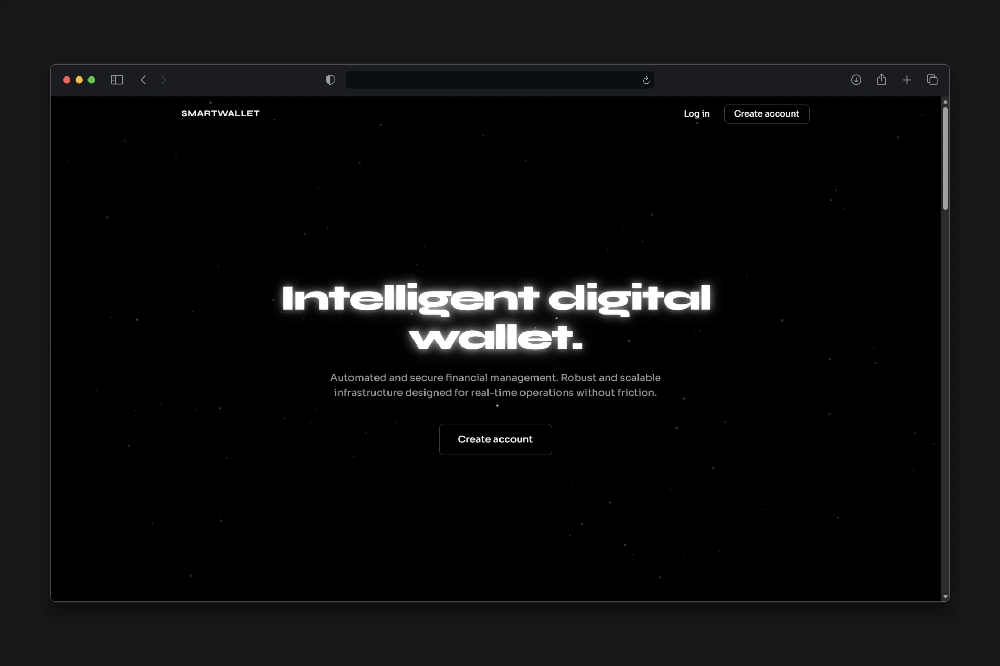
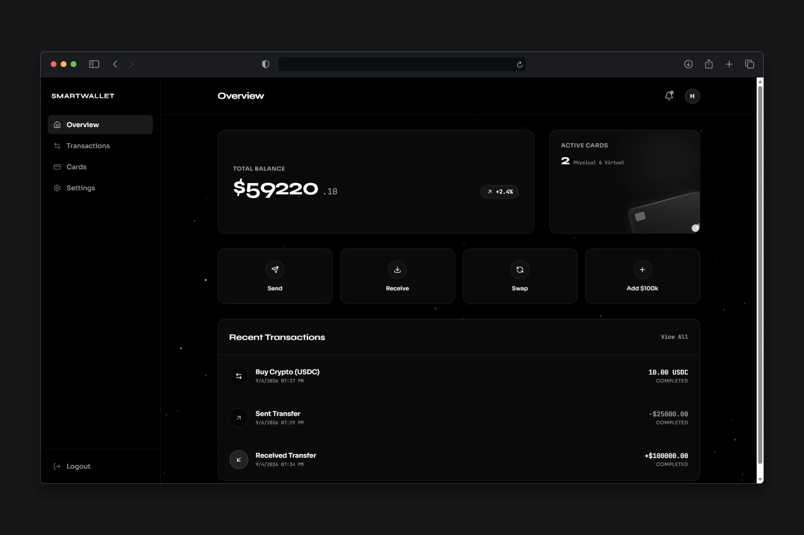
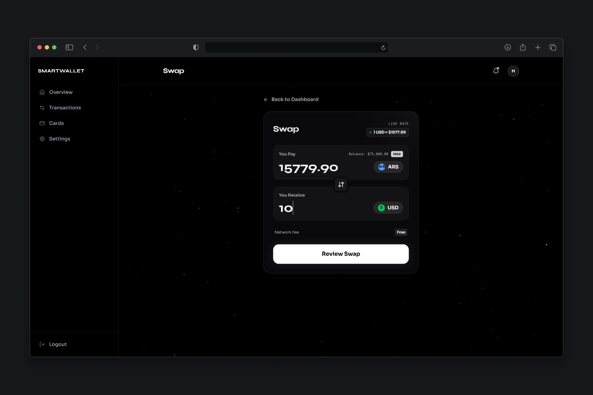
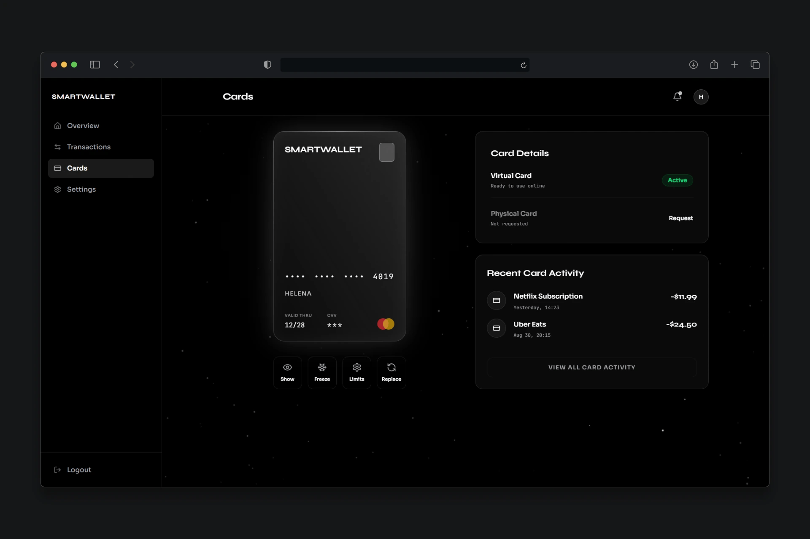
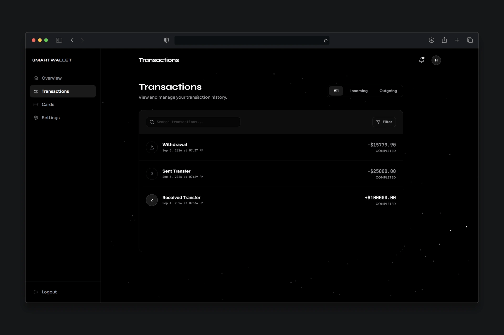
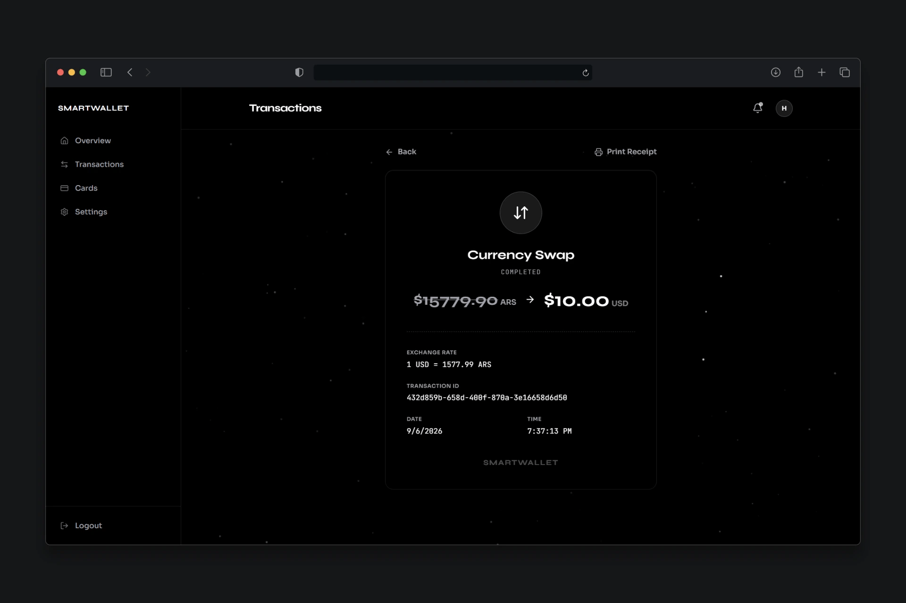
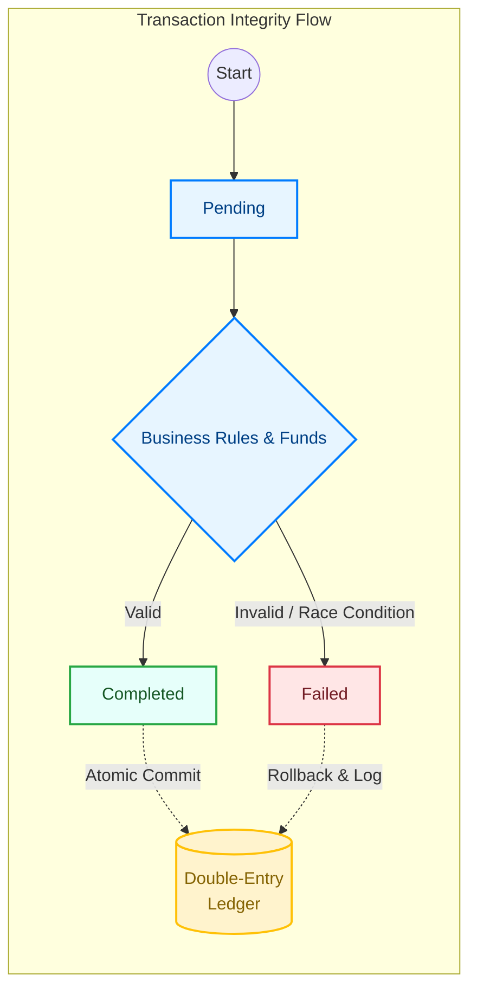

# 💳 SmartWallet - Enterprise-Grade Digital Banking Ecosystem


**SmartWallet** is a high-performance digital banking infrastructure designed with **Clean Architecture** and **Domain-Driven Design (DDD)** principles. It was architected from scratch to solve critical FinTech challenges: absolute data integrity, system resilience, and enterprise-level scalability.

> **Key Engineering Differentiator:** Unlike standard CRUD applications, SmartWallet implements an immutable, double-entry **Transaction Ledger** combined with **Optimistic Concurrency** and **Circuit Breaker** patterns to guarantee zero data loss and fault tolerance under high-load scenarios.

## 📸 Application Previews

<p align="center">
  
  
</p>
<p align="center">
  
  
</p>
<p align="center">
  
  
</p>

---

## 🌐 Live Demo & Deployment Note

**Frontend:** The UI is deployed on Vercel for visual showcase purposes.  
**Backend:** For security and performance, the .NET backend is containerized (Docker + SQL Server). To experience full functionality (transactions, ledger auditing), the backend must be deployed locally using the instructions in the [Getting Started](#-getting-started) section.

---

## 🧠 Architectural Decisions & Engineering Practices

As a Senior-level backend implementation, the system prioritizes maintainability, data integrity, and performance.

### 1. Clean Architecture & Domain-Driven Design (DDD)
The solution avoids "Anemic Domain Models" by encapsulating business rules directly within the Entities (e.g., Wallet, TransactionLedger). 
* **CQRS Pattern:** Strict separation of Commands (state-changing operations like Transfers) and Queries (read-only operations like Balance checks) ensures optimized data access and scalability.
* **Dependency Inversion:** The Core Domain has zero external dependencies. Infrastructure (SQL Server, Azure APIs) depends on abstractions defined in the Domain.

### 2. ACID Transactions & Concurrency Handling
Financial systems cannot tolerate race conditions or double-spending.
* **Unit of Work:** Implemented to ensure that multi-step operations (e.g., deducting from Wallet A, crediting Wallet B, and writing two Ledger entries) are executed as a single, atomic database transaction. If any step fails, the entire operation rolls back safely.
* **Concurrency Control:** Utilized EF Core concurrency tokens (RowVersion) to prevent double-spending anomalies during concurrent transfer requests.

### 3. Resilience & Fault Tolerance
Integrating with external financial APIs (e.g., Currency Exchange) introduces network volatility.
* **Circuit Breaker & Retry Policies (Polly):** Configured exponential backoff retries. If an external service fails repeatedly, the Circuit Breaker trips, failing fast to prevent thread pool starvation and cascading system failures across microservices.

### 4. Performance Optimizations
* **Memory & Read Speeds:** AsNoTracking() applied to all read-only EF Core queries to bypass the change tracker, significantly reducing memory allocation.
* **Strategic Indexing:** Built composite indexes on (WalletId, CreatedAt) to optimize pagination and historical ledger queries.
* **Asynchronous I/O:** 100% sync/await utilized from the Controller layer down to the database driver to maximize thread availability under high concurrent load.

### 5. Security & DevSecOps
* **Secrets Management:** Integration with **Azure Key Vault** prevents hardcoded secrets and securely injects database connections and JWT symmetric keys at runtime.
* **Options Pattern:** Strongly typed configuration bindings (IOptionsSnapshot<T>) with built-in data annotations validation for ppsettings.json.
* **CI/CD Automation:** Containerized delivery using Docker and automated pipelines via GitHub Actions.

---

## 🏗️ System Architecture Flow

<p align="center">
  
</p>

---

## 🔌 API Endpoints Overview

The API is secured using **JWT Bearer Tokens**. Authorization policies ensure data privacy, while specific administrative actions are restricted to the Admin role.

### 🔐 Authentication & Identity
| Method | Endpoint | Description | Auth |
| :--- | :--- | :--- | :--- |
| POST | /api/auth/login | Authenticate user and retrieve JWT Token. | Public |
| POST | /api/user/register | Register a new user account. | Public |

### 💰 Wallet & Transactions
| Method | Endpoint | Description | Auth |
| :--- | :--- | :--- | :--- |
| GET | /api/wallet/by-user/{userId} | List all wallets owned by a user. | Owner/Admin |
| POST | /api/transactions/deposits | Perform a cash-in operation. | User |
| POST | /api/transactions/transfers | Transfer funds between internal wallets (ACID). | User |
| GET | /api/transactions/wallet/{id} | Get transaction history (Paginated). | User |

### 📜 Financial Ledger (Auditing)
*Immutable records for accounting reconciliation.*
| Method | Endpoint | Description | Auth |
| :--- | :--- | :--- | :--- |
| GET | /api/transactionledgers/transaction/{txId} | Trace double-entry ledger entries for a transaction. | **Admin** |
| GET | /api/transactionledgers/range | Export ledger entries by date range. | **Admin** |

---

## 🔄 Transaction Lifecycle & State Machine



---

## 🐳 Getting Started (Local Deployment)

### Prerequisites
- .NET 8 SDK
- Docker Desktop

### Run with Docker (Recommended)
The project includes a docker-compose.yml for instant setup of the API and SQL Server.

`ash
# 1. Clone the repository
git clone https://github.com/m4lcom/SmartWalletBackend.git

# 2. Navigate to directory
cd SmartWalletBackend

# 3. Build and Run containers
docker-compose up -d --build
```

Access the API documentation at: http://localhost:8080/swagger

---

Developed by: m 4 l c o m - Backend Developer (.NET)

